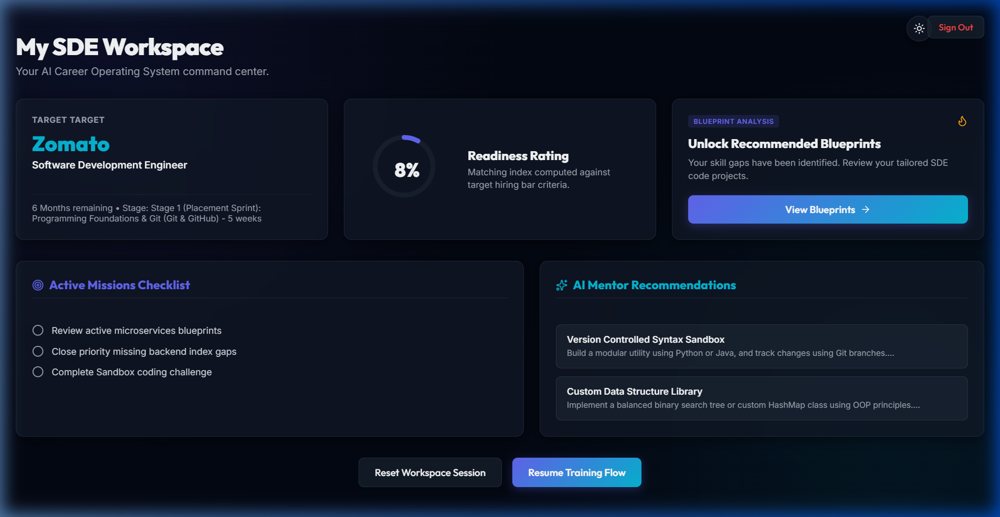
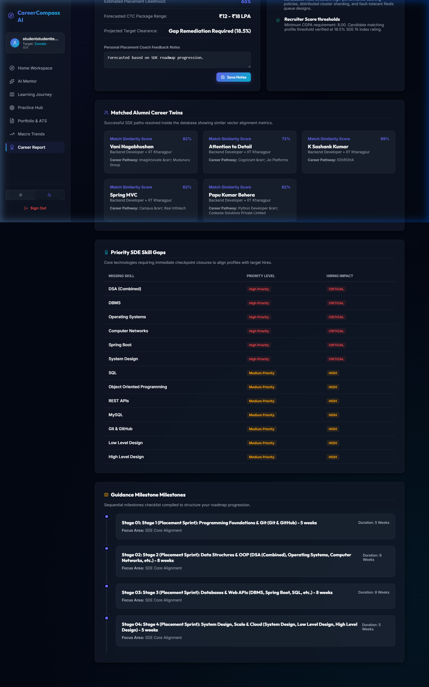
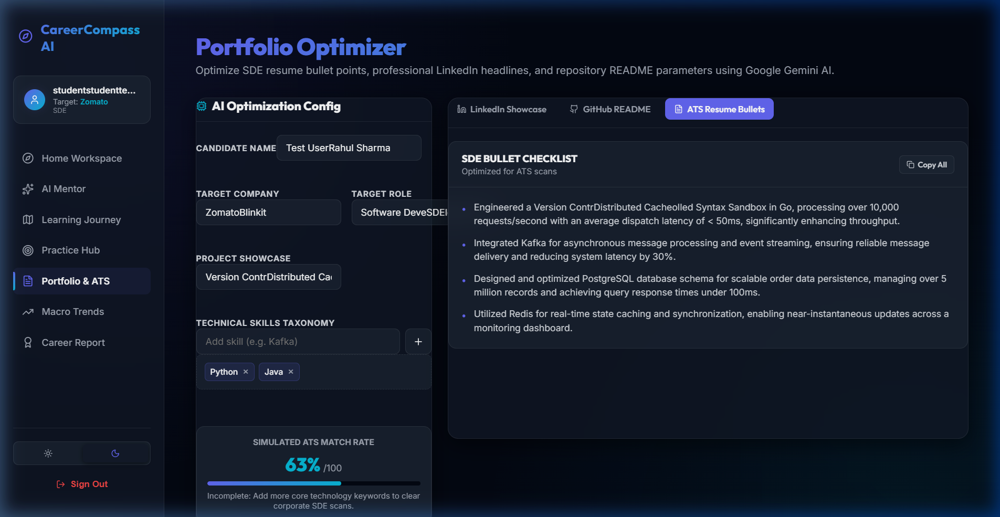
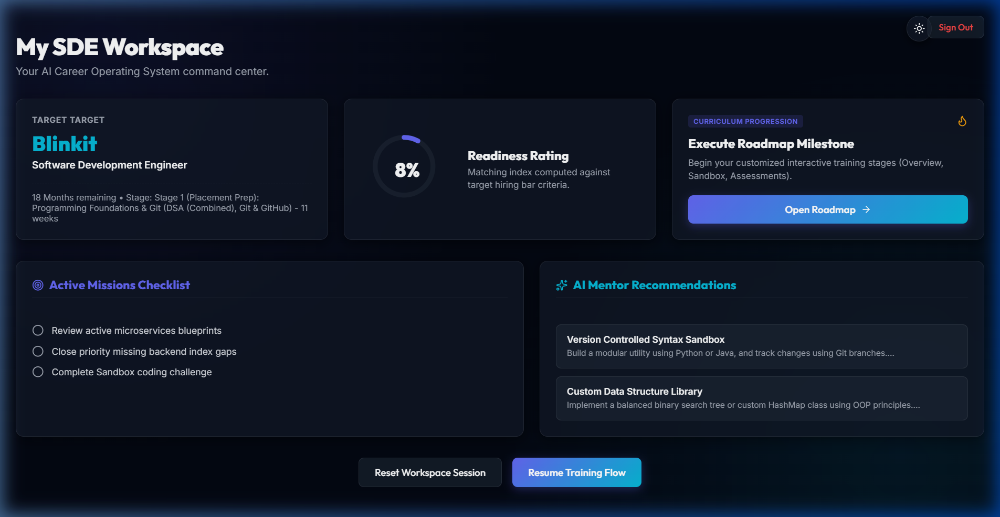

# CareerCompass AI 🧭
### Hybrid AI Career Intelligence Platform

[](https://www.python.org/)
[](https://fastapi.tiangolo.com/)
[](https://react.dev/)
[](https://www.postgresql.org/)
[](https://scikit-learn.org/)

---

## 🖥️ Platform Showcase

Below are actual screenshots of the CareerCompass AI application in action:

| **Main Workspace Dashboard** | **Detailed Career Report & Similarity** |
| :---: | :---: |
|  |  |

| **ATS Resume Builder** | **Profile Builder & Skill Normalization** |
| :---: | :---: |
|  |  |


---

## 📊 Project at a Glance

| Component / Metric | Details |
|---|---|
| **Professional Profiles** | 486 SDE Candidate Profiles |
| **Canonical Skills** | 53 SDE Ontology Dimensions |
| **Target Roles** | 30 Engineering Tracks |
| **PostgreSQL Database** | 49 Structured Schema Tables |
| **Core Decision Engines** | 7 Dedicated Rule & Similarity Engines |
| **ML Specialization Models** | 3 Custom Classifiers (Frontend, Backend, General SDE) |
| **Architectural Model** | Single Page Application (FastAPI + React) |

---

## 📖 Project Overview

### Problem Statement
Students preparing for software development engineering (SDE) roles face significant navigation challenges:
- **Lack of Year-Aware Planning**: Pacing requirements differ drastically for a 1st-year student versus a graduating senior.
- **Undetected Skill Gaps**: Mismatches between student skill sets and specific target company requirements go unnoticed.
- **Implicit Hiring Patterns**: Standard preparation tracks fail to align with the active hiring stacks of target companies.
- **Lack of Explainability**: Recommendations are typically static checklists that do not explain the technical reasoning behind required milestones.

### Solution
**CareerCompass AI** is a Career Intelligence Platform that integrates a structured knowledge layer, explainable decision engines, and custom machine learning models to generate personalized, time-sensitive roadmaps. The system evaluates candidate input against a 53-skill ontology and a dataset of 486 software engineering profiles, returning readiness scores, prioritized skill gaps, and custom assessments supported by transparent audit traces.

---

## 🚀 Key Features

*   **✔ Resume Parsing**: Ingests resume text to extract qualifications and normalized skills.
*   **✔ GitHub Analysis**: Scans repositories to map language distribution and project highlights.
*   **✔ LinkedIn Analysis**: Processes professional headlines and experience timelines.
*   **✔ Skill Confirmation Heuristics**: Standardizes free-text skills to canonical ontology nodes.
*   **✔ Skill Gap Analysis**: Highlights missing competencies relative to company baselines.
*   **✔ Calibrated Readiness Scoring**: Estimates qualification-aware readiness metrics.
*   **✔ Career Twin Similarity**: Matches candidates against database profiles to find professional twins.
*   **✔ Custom ML Specialization Affinity**: Estimates alignment with frontend, backend, or general tracks.
*   **✔ Adaptive Roadmap Generator**: Schedules stage-by-stage prep tasks based on graduation timeline.
*   **✔ Stage-wise Assessments**: Links roadmaps to multiple-choice checkpoints and coding templates.
*   **✔ Customized Interview Planner**: Generates company-specific mock interview questions.
*   **✔ ATS Resume Assistant**: Matches candidate project descriptions to target job keywords.
*   **✔ Explainable AI (XAI) Trace**: Emits detailed audit logs showing the parameters behind recommendations.
*   **✔ Out-of-Distribution Fallback**: Fallbacks to rules if candidate profiles deviate from expected distributions.
*   **✔ Interactive AI Mentor**: Converses with candidates to provide tailored feedback on gaps and milestones.

---

## 🏗️ System Architecture & AI Pipeline

The platform runs candidate queries through a multi-stage pipeline:

```
[Student Profile (Resume/LinkedIn/GitHub)]
                   │
                   ▼
       [Knowledge Extraction Engine]
                   │
                   ▼
     [Ontology-Based Skill Normalization]
                   │
                   ▼
    ┌────────────────────────────────────────┐
    │  Knowledge-Based Decision Engines      │
    │  - Cosine Similarity & Twin matching   │
    │  - Skill Gap & Readiness Scoring       │
    │  - Roadmap & Interview Planning        │
    └──────────────────┬─────────────────────┘
                       │
                       ▼
    ┌────────────────────────────────────────┐
    │  ML Specialization Affinity Engine     │
    │  - TF-IDF Feature Builder              │
    │  - Calibrated Logistic Regression      │
    │  - Anomaly & OOD Fallback Checks       │
    └──────────────────┬─────────────────────┘
                       │
                       ▼
       [Decision Trace Audit Log Generation]
                   │
                   ▼
    [Gemini LLM Explanations & AI Mentoring]
                   │
                   ▼
        [Interactive React SPA View]
```

Detailed architectural diagrams and state-transition parameters are available in the [System Architecture Document](./docs/SYSTEM_ARCHITECTURE.md).

---

## 🛠️ Technology Stack

| Layer | Technologies |
|---|---|
| **Frontend Client** | React, Vite, JavaScript, Chart.js, HTML5, Vanilla CSS |
| **Backend Server** | FastAPI, Python 3.10+, Uvicorn, Pydantic |
| **Database System** | PostgreSQL 14+, Psycopg2 (relational schema, session logging) |
| **AI Layer** | Gemini API, Google GenAI SDK, Custom Rule-Based NLP Parsers |
| **ML Engine** | Scikit-learn, Logistic Regression, Platt Scaling, Joblib |

---

## 🔭 Research & Product Vision

CareerCompass AI is intended to evolve into a Career Intelligence Platform that combines structured career knowledge, explainable AI, and machine learning to help students prepare for industry-specific roles.

Planned future enhancements include:
*   **Expanded Role Database**: Support for 30+ non-SDE roles, including DevOps, SRE, and Product Management.
*   **Placement Cell Analytics**: Aggregate dashboards for university placement departments to track cohort readiness.
*   **Reinforcement Learning (RL) Ranking**: Adaptive ranking of learning resources based on candidate outcomes.
*   **Semantic Matching**: Integration of vector databases (`pgvector`) for context-rich profile twin similarity.

---

## 📂 Documentation & Deep Dives

To review detailed design metrics, evaluation datasets, and codebase parameters, explore the following documents:

*   **[System Architecture (SYSTEM_ARCHITECTURE.md)](./docs/SYSTEM_ARCHITECTURE.md)**: Deep dive into the hybrid decision loop, positive stage filters, and session transition gates.
*   **[Model Card (MODEL_CARD.md)](./docs/MODEL_CARD.md)**: Detailed ML model metrics, classification PR-AUC values, calibration curves, and OOD performance.
*   **[Data Card (DATA_CARD.md)](./docs/DATA_CARD.md)**: Structured database layers (employee, company, interview, learning, coding, student, intelligence) and row statistics.
*   **[Submission Report (SUBMISSION_REPORT.md)](./docs/SUBMISSION_REPORT.md)**: Internship milestones, verification artifacts, and validation suite summaries.
*   **[Known Limitations (KNOWN_LIMITATIONS.md)](./docs/KNOWN_LIMITATIONS.md)**: Analysis of class imbalances, ontology boundaries, and external data dependencies.

---

## 📄 License

This project is licensed under the MIT License. See the `LICENSE` file for details.
