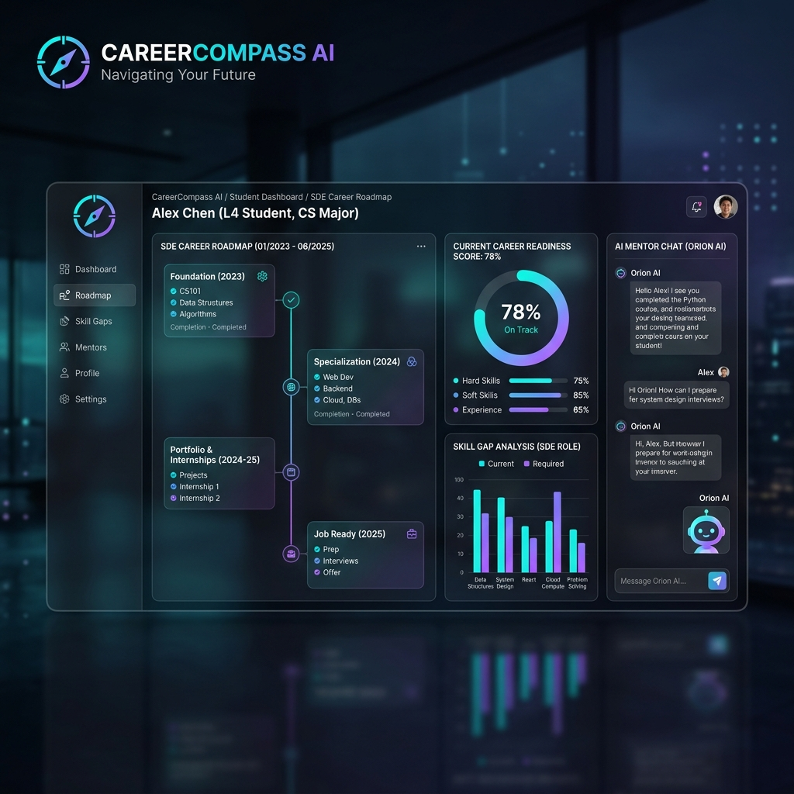

# CareerCompass AI 🧭
### Hybrid AI Career Intelligence Platform using Knowledge-Based Decision Engines, Custom ML Affinity Models, and Explainable Recommendations

[](https://www.python.org/)
[](https://fastapi.tiangolo.com/)
[](https://react.dev/)
[](https://www.postgresql.org/)
[](https://scikit-learn.org/)

---

## 🖥️ Platform Preview



---

## 📊 Project at a Glance

| Metric | Detail / Value |
|---|---|
| **Profiles Collected** | 486 SDE Candidate Profiles (mapped from active industry records) |
| **Ontology Dimensions** | 53 Canonical SDE Skills |
| **PostgreSQL Tables** | 49 Structured Schema Tables |
| **ML Specialization Models** | 3 Custom-Trained Classification & Affinity Models |
| **Core Decision Engines** | 7 Dedicated Rule-Based & Similarity Engines |
| **Backend Framework** | FastAPI (Python) |
| **Frontend Framework** | React (Vite SPA) |
| **Validation Suites** | 7 Rule-Based & Session Isolation Tests |

---

## 📖 Project Overview

### Problem Statement
Students targeting software development engineering roles often face generic, one-size-fits-all roadmaps. They struggle with:
1. **Lack of Year-Aware Planning**: A first-year student and a final-year graduate need different pacing and goals.
2. **Invisible Skill Gaps**: Unclear mapping between student profiles and company-specific requirements.
3. **Implicit Hiring Patterns**: Mismatches between student prep and target company tech stacks.
4. **Lack of Explainability**: Recommendations are often black-box, missing the reasoning behind specific milestones.

### Solution
**CareerCompass AI** is a Hybrid AI Career Intelligence Platform. It maps a candidate's profile (parsed from resumes, LinkedIn, and GitHub) against a structured **53-skill ontology** and a database of **486 real-world SDE profiles**. Using custom-trained ML models and deterministic decision engines, it creates personalized, stage-by-stage preparation roadmaps complete with coding assessments, interview prep, and explainable AI traces.

---

## 🚀 Key Features

*   **✔ Resume Parsing**: Direct text extraction mapping experiences to canonical skills.
*   **✔ GitHub Analysis**: Repository scans and API pulls to extract language and framework distributions.
*   **✔ LinkedIn Analysis**: Section parsing to harvest professional work histories and titles.
*   **✔ Skill Confirmation**: Heuristic validation filters mapping raw inputs to standardized skill nodes.
*   **✔ Skill Gap Analysis**: Detailed mapping showing exactly which required skills are missing or weak.
*   **✔ Readiness Score**: A calibrated percentage matching candidate readiness against company standards.
*   **✔ Career Twin Analysis**: Matches the student against the database of 486 software developers to find their closest "professional twins" at target companies.
*   **✔ Custom ML Affinity Models**: Calculates path alignment (Frontend, Backend, General SDE) using logistic regression probabilities.
*   **✔ Stage-wise Roadmap**: Generates sequential preparation steps tailored to graduation timelines.
*   **✔ Projects Recommendations**: Recommends specific portfolio projects designed to fill identified skill gaps.
*   **✔ Coding Session Templates**: Checkpoint challenges mapped directly to roadmap milestones.
*   **✔ MCQ Checkpoints**: Interactive quizzes testing topic competency at each stage.
*   **✔ Interview Planner**: Customized company-specific questionnaires tailored to candidate profile gaps.
*   **✔ ATS Resume Builder**: Automatically creates resume copy matching target job keywords.
*   **✔ Explainable AI (XAI) Trace**: Auditable decision traces displaying the technical rationale behind every recommendation.
*   **✔ Out-of-Distribution (OOD) Fallback**: Fallback checks that transition from ML/LLM models to rule-based logic when data is anomalies.
*   **✔ AI Mentor Interaction**: Real-time glassmorphic chat interface powered by explainable parameters.

---

## 🏗️ System Architecture

```
                                  ┌─────────────────────────────┐
                                  │      Candidate Input        │
                                  │   (Resume/LinkedIn/GitHub)  │
                                  └──────────────┬──────────────┘
                                                 │
                                                 ▼
                                  ┌─────────────────────────────┐
                                  │    Knowledge Extraction     │
                                  │   (NLP Entity Classifier)   │
                                  └──────────────┬──────────────┘
                                                 │
                                                 ▼
                                  ┌─────────────────────────────┐
                                  │     Skill Normalization     │
                                  │      (53-Skill Ontology)    │
                                  └──────────────┬──────────────┘
                                                 │
                                                 ▼
     ┌───────────────────────────────────────────┼───────────────────────────────────────────┐
     │ Decision Engine                           │                                           │
     │ ┌──────────────────────┐ ┌────────────────▼─────┐ ┌─────────────────────────────────┐ │
     │ │   Similarity Engine  │ │   Skill Gap Engine   │ │     Readiness Scoring Engine    │ │
     │ └──────────────────────┘ └──────────────────────┘ └─────────────────────────────────┘ │
     │ ┌──────────────────────┐ ┌──────────────────────┐ ┌─────────────────────────────────┐ │
     │ │  Career Twin Engine  │ │    Roadmap Planner   │ │        Interview Planner        │ │
     │ └──────────────────────┘ └──────────────────────┘ └─────────────────────────────────┘ │
     └───────────────────────────────────────────┬───────────────────────────────────────────┘
                                                 │
                                                 ▼
                                  ┌─────────────────────────────┐
                                  │   ML Specialization Model   │
                                  │  (Logistic Regression +     │
                                  │    Platt Probability)       │
                                  └──────────────┬──────────────┘
                                                 │
                                                 ▼
                                  ┌─────────────────────────────┐
                                  │     Decision Trace Log      │
                                  │    (Audit-Log Export)       │
                                  └──────────────┬──────────────┘
                                                 │
                                                 ▼
                                  ┌─────────────────────────────┐
                                  │     Gemini Explanations     │
                                  │  (Explanations & Mentoring) │
                                  └──────────────┬──────────────┘
                                                 │
                                                 ▼
                                  ┌─────────────────────────────┐
                                  │      Career Dashboard       │
                                  │   (React SPA User View)     │
                                  └─────────────────────────────┘
```

---

## 🤖 AI Architecture (NLP & Decision Engines)

1. **NLP Extraction Pipeline**: Uses Gemini LLM APIs (utilizing system prompts and JSON schemas) to extract qualifications and skills. Installs a regex-based tokenizing classifier if API connections fail.
2. **Decision Engine Layer**:
    *   **Similarity Engine**: Compares candidates against employees using cosine distances.
    *   **Skill Gap Engine**: Performs set-difference analysis against target-role skill profiles.
    *   **Readiness Engine**: Weights overlapping and missing skills based on role frequency.
    *   **Career Twin Engine**: Evaluates database records to select the top 3 closest profile paths.
    *   **Roadmap Planner**: Dynamically partitions stages based on candidate qualification time margins.
    *   **Interview Planner**: Matches company descriptions to candidate gaps to recommend relevant prep questions.

---

## 📈 ML Architecture (Affinities & Classification)

*   **Feature Builder**: Vectorizes candidates' normalized skills using binary TF-IDF mappings against the 53-skill ontology.
*   **Custom ML Models**: Logistic Regression models are trained on the 486 collected developer profiles to predict engineering specialization affinity (Backend, Frontend, Fullstack/General).
*   **Model Calibration**: Applied Platt Scaling (probability calibration) to convert raw classifier decisions into reliable path alignment probabilities.
*   **Out-of-Distribution (OOD) Fallback**: If a candidate's profile does not fit standard distributions (e.g., zero SDE skills or conflicting parameters), the system triggers OOD fallback flags and defaults to heuristic-based rule paths instead of predicting erroneous ML outputs.

---

## 🗄️ Database Architecture (Knowledge Layer)

The database schema (`database/schema.sql`) represents a structured 8-tiered knowledge base containing **49 PostgreSQL tables**:

```
               ┌────────────────────────────────────────────────────────┐
               │                    Knowledge Layer                     │
               └───────────────────────────┬────────────────────────────┘
                                           │
          ┌────────────────────────────────┼───────────────────────────────┐
          │                                │                               │
          ▼                                ▼                               ▼
┌────────────────────┐          ┌────────────────────┐          ┌────────────────────┐
│   employee_layer   │          │   company_layer    │          │  interview_layer   │
│(employee_profiles, │          │    (companies,     │          │(interview_question_│
│career_transitions, │          │ company_metadata,  │          │   skill_mapping,   │
│education_profiles) │          │ job_descriptions)  │          │interview_question) │
└────────────────────┘          └────────────────────┘          └────────────────────┘
          │                                │                               │
          ├────────────────────────────────┼───────────────────────────────┤
          │                                │                               │
          ▼                                ▼                               ▼
┌────────────────────┐          ┌────────────────────┐          ┌────────────────────┐
│   learning_layer   │          │    coding_layer    │          │   student_layer    │
│(roadmaps, stages,  │          │ (stage_assessments,│          │(students, skills,  │
│stage_resources,    │          │     mcqs, mcq_     │          │ student_progress,  │
│stage_skills)       │          │   skill_mapping)   │          │ student_dynamic)   │
└────────────────────┘          └────────────────────┘          └────────────────────┘
                                           │
                                           ▼
                                ┌────────────────────┐
                                │ intelligence_layer │
                                │ (recommendation_   │
                                │    audit_log,      │
                                │candidate_skill_gap)│
                                └────────────────────┘
```

---

## 🛠️ Technology Stack Matrix

| Layer | Technologies Used |
|---|---|
| **Frontend** | React, Vite, Canvas API, Chart.js, HTML5, Vanilla CSS (premium Glassmorphic style tokens) |
| **Backend** | FastAPI, Python 3.10+, Uvicorn, Pydantic |
| **Database** | PostgreSQL 14+, Psycopg2 (connection pooling, schema migration) |
| **AI/NLP** | Gemini API, Google GenAI SDK, Custom Rule-Based Parsing Heuristics |
| **ML Engine** | Scikit-learn, Logistic Regression Classifier, Platt Probability Calibrator, Joblib |
| **Testing** | unittest, requests, PostgreSQL Session Isolation |

---

## 📦 Installation & Setup

### 1. Database Creation & Seeding
Ensure you have a local PostgreSQL instance running. Initialize the database schema and seed datasets:
```sql
CREATE DATABASE career_compass_ai;
\c career_compass_ai
\i database/schema.sql
\i database/seed_data.sql
```

### 2. Setup Environment Variables
Copy `.env.example` to `.env` in the root of the project:
```bash
cp .env.example .env
```
Open the `.env` file and configure the parameters:
*   `GEMINI_API_KEY`: Your Google Gemini API key.
*   `DB_PASSWORD`: Your local PostgreSQL password.
*   `QUIZ_API_KEY`: Your QuizAPI key (optional).

### 3. Setup Backend Environment & Dependencies
Create a virtual environment and install backend requirements:
```bash
# From project root
python -m venv .venv
.venv\Scripts\activate      # For Windows Powershell/CMD
source .venv/bin/activate    # For macOS/Linux

pip install fastapi uvicorn psycopg2-binary pydantic python-dotenv
```

### 4. Run Backend FastAPI Server
Start the backend web server:
```bash
python api/app.py
```
The backend server will run at `http://127.0.0.1:8000`.

### 5. Setup React Frontend
Navigate to the frontend folder, install dependencies, and run Vite:
```bash
cd frontend-react
npm install
npm run dev
```
The web application will open at `http://localhost:5173`.

---

## 🧪 Testing & Verification

Run the integration and regression test suites to verify system modules:
```bash
# Run NLP classifier & gap validation tests
python testing/run_tests.py

# Run API session state transition tests
python testing/verify_session_flow.py

# Run database schema sandbox isolation checks
python testing/verify_session_isolation.py
```

---

## 🗺️ Future Roadmap

*   **30+ Roles Catalog**: Index other industry-specific roles including Product Managers, DevOps Engineers, and Data Scientists.
*   **Placement Cell Analytics Dashboard**: Implement high-fidelity dashboards for colleges and universities to track students' aggregate readiness scores.
*   **Reinforcement Learning Ranking**: Implement feedback loops that dynamically adjust learning resource scores based on student success rates.
*   **Vector Database Graph**: Integrate `pgvector` for semantic matching of resumes and profile metadata.

---

## 📄 License

This project is licensed under the MIT License. See the `LICENSE` file for details.
